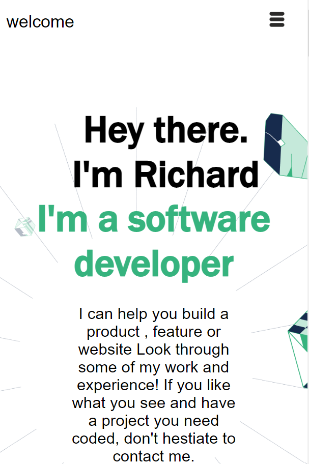
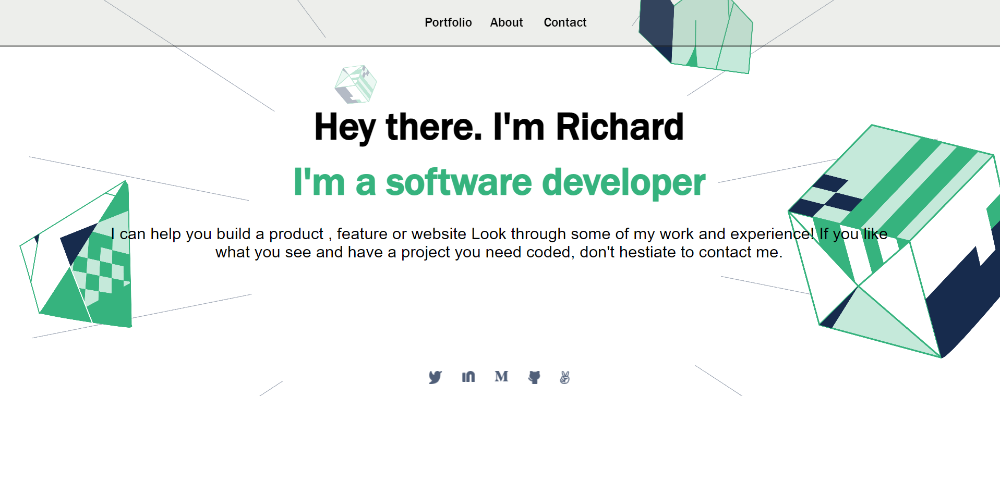

# Hello Microverse
> This is my Microverse portfolio website which was built using HTML and CSS with Linters for error detection, This project is more specific to the desktop version using media query for responsiveness.

## Built With
 
  HTML5, CSS3 & JavaScript
  
  Using Linters

 ## Live Demo 

[Live Demo Link](https://xrichardroidx.github.io/My-Microverse-Portfolio/)
 -->

<!-- ## Getting Started

**This is an example of how you may give instructions on setting up your project locally.**
**Modify this file to match your project, remove sections that don't apply. For example: delete the testing section if the currect project doesn't require testing.** -->

<!-- To get a local copy up and running follow these simple example steps.

### Prerequisites

### Setup

### Install

### Usage

### Run tests

### Deployment -->

## Authors

👤 **Author1**

- GitHub: [@githubhandle](https://github.com/xrichardroidx)
- Twitter: [@twitterhandle](https://twitter.com/RichardroiDX)
- LinkedIn: [LinkedIn](https://www.linkedin.com/in/richard-oguzie-ibeh-b4a975231/?originalSubdomain=ng)

<!-- 👤 **Author2** -->

<!-- - GitHub: [@githubhandle](https://github.com/githubhandle)
- Twitter: [@twitterhandle](https://twitter.com/twitterhandle)
- LinkedIn: [LinkedIn](https://linkedin.com/in/linkedinhandle) -->

## 🤝 Contributing

Contributions, issues, and feature requests are welcome!

Feel free to check the [issues page](https://github.com/XRichardroidX/My-Microverse-Portfolio/issues).

 ## Show your support

Give a ⭐️ if you like this project!

## Acknowledgments

- Hat tip to anyone whose code was used
- Inspiration
- etc

## 📝 License

This project is [MIT](MIT.md) licensed.

<!-- _NOTE: we recommend using the [MIT license](https://choosealicense.com/licenses/mit/) - you can set it up quickly by [using templates available on GitHub](https://docs.github.com/en/communities/setting-up-your-project-for-healthy-contributions/adding-a-license-to-a-repository). You can also use [any other license](https://choosealicense.com/licenses/) if you wish._ -->
